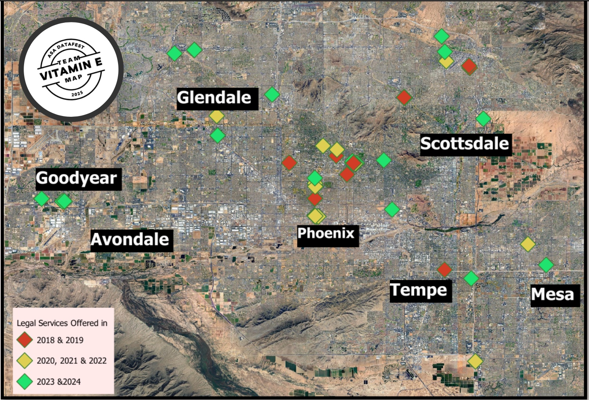

##### Download

+ [Paper](write_up.pdf)

---

##### Abstract

In the Datafest 2025 competition, this project was done over the span of 2 days. The data was given by Savill, one of the world's leading real estate service providers. Using Pheonix Arazona as our case study, we studied the correlation between classified and unclassified companies to determine if there were trends that the company was not able to notice.

---

##### Figure 1: The map of Phoenix with the locations of all lawfirms over the years

---

##### Technology used
- Pandas
- Google API

##### Citation
 Arizona Crime Statistics: Crime Overview 2024

 US Census Bureau: Population Estimates, July 1, 2024

##### Related material
+ [Presentation](lawfirm_presentation.pptx)