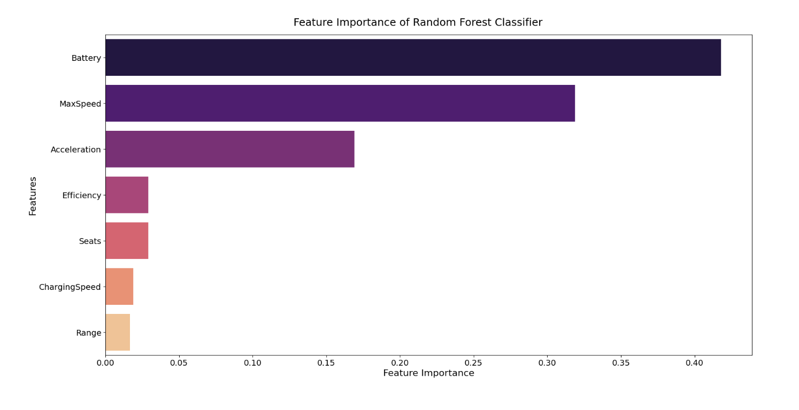

---

##### Download

+ [Paper](project1.pdf)
+ [The code](drivers_code.ipynb)
+ [The data](https://ev-database.org/#sort:path~type~order=.rank~number~desc%7Crs-price:prev~next=10000~100000%7Crs-range:prev~next=0~1000%7Crs-fastcharge:prev~next=0~1500%7Crs-acceleration:prev~next=2~23%7Crs-topspeed:prev~next=110~350%7Crs-battery:prev~next=10~200%7Crs-towweight:prev~next=0~2500%7Crs-eff:prev~next=100~350%7Crs-safety:prev~next=-1~5%7Cpaging:currentPage=0%7Cpaging:number=10)

---

##### Abstract

The objective of the analysis is to determine which variables are the drivers of the cost of electric 
vehicles (EV). We will be using the data set “Current and Upcoming Electric Vehicles” from EV 
Database to explore what influences electric car prices. For potential electric vehicle buyers, it is 
important to be informed when making a substantial purchase. The purpose of this analysis is to 
help inform buyers the different features that are important to the build of an electric vehicle. 
Features such as battery capacity, distance per single charge, the make of a car and so on can 
greatly impact the overall ownership experience. Furthermore, understanding how the features 
affect the costs of the vehicles help inform buyers of how to best budget their spending. On a 
larger scale, price prediction helps to inform important business decisions in budget planning and 
market analysis.

---

##### Figure 4: Feature importance of Random Forest Classifier

---

##### Citation

<!-- cite the dataset -->

---

##### Related material
